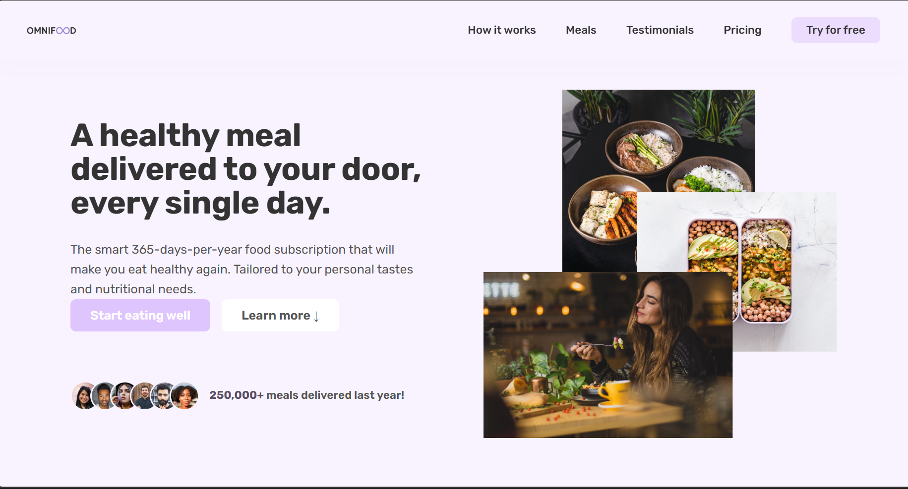

# 🍽️ Omnifood: AI-Powered Meal Delivery - Landing Page

This repository contains a fully responsive, modern **landing page** for **Omnifood**, an AI-powered subscription service that delivers healthy meals all year round. Built using **HTML5** and **CSS3**, this project focuses on clean design, responsiveness, and strong UX/UI principles.

---

## 📁 Repository Structure

```
├── index.html
├── css/
│   ├── style.css
│   └── queries.css 
│
├── img/
│   ├── logo1.png
│   ├── hero.png
│   ├── favicon_final.jpg
│   ├── customers/
│   ├── gallery/
│   ├── logos/
│   └── meals/
│
├── js/
│   └── script.js
├── main.png (preview image)
```

---

## 🎨 Project Preview



---

## ✨ Features

### ✅ Key Sections
- **Hero Section**: Grabs users' attention immediately.
- **How It Works**: Explains the service in three easy steps.
- **Meals Section**: Displays meal options and diet plans.
- **Testimonials**: Real customer feedback.
- **Pricing Plans**: Clear and concise subscription options.
- **Call To Action (CTA)**: Capture leads through signup forms.

### 📈 Interactive Elements
- Sticky navigation bar
- Smooth scrolling behavior
- Hover effects on buttons and meal cards

---

## 🛠️ Tools & Technologies

| Technology       | Purpose                             |
| ---------------- | ----------------------------------- |
| **HTML5**        | Structure and content               |
| **CSS3**         | Styling and layout                  |
| **Flexbox & Grid**| Responsive layout                  |
| **Ionicons**     | Icons for meals, features, and social links |
| **Google Fonts** | Typography (Inter, Rubik)            |

---

## 📂 Key Folders Overview

- `/img/` — All images including logos, meals, testimonials, and galleries.
- `/css/` — Stylesheets for layout and responsiveness.
- `/js/` — JavaScript functionality (currently minimal).
- `/main.png` — Preview of the landing page for README display.

---

## 📥 Getting Started

To view this project locally:

```bash
git clone https://github.com/your-username/your-repository-name.git
cd your-repository-name
```
- Open `index.html` in your browser.

---

## 🚀 Future Improvements

- Animate section entrances using CSS or JS libraries.
- Build backend integration for signup and user data.

---

## 📌 Use Cases

- Portfolio showcase for front-end skills.
- Template base for startups or food delivery services.
- Practice project for responsive web development.

---


